# <b style="color: #8989f5">AIditor</b>
<div align="center">
    <h3>" 당신을 위한 SNS AI 서포터 📷 <b style="color: #b277e8">AIditor(아이디터)</b>를 소개합니다. "</h3>
    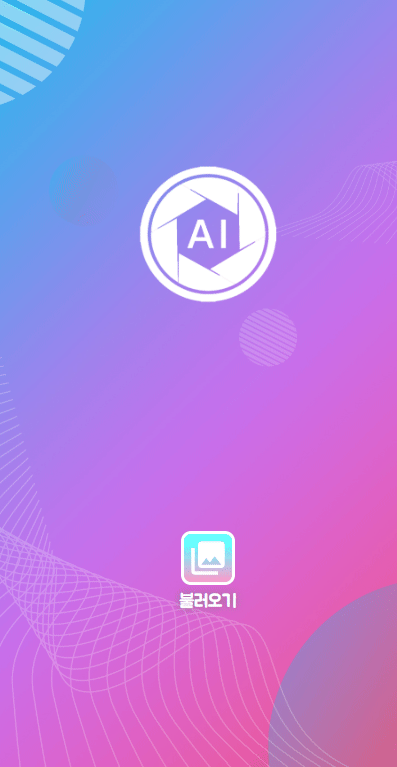</img>
</div>


<br/><br/>

### 🙋‍️<b>구성원 소개</b>🙋‍
**심예주, 김도하, 김병철, 김신재, 박수진, 이대직**

<br/>


### :trophy: <b>서비스 소개</b>


#### **📷 AIditor**

👉 SNS를 즐겨하는 사람들을 위한 포토 에디터 :)

👉 매우 큰 SNS시장에서 사용자의 니즈를 충족시키기 위한 프로그램

👉 당신을 <b>인싸</b>로 만들어줄 <b>잇아이템!!!</b>

<br/><br/>

#### <b style="color:#b277e8"> AI 기능</b>

<b color="#8989f5" style="color:#8989f5">해시태그추천</b>

+ 인스타그램에서 크롤링 한 총 90,000개 이상의 데이터를 전처리하여 최종적으로 19개의 해시태그와 20,000개 이상의 데이터로 학습시킨 SNS 성격의 <b>해시태그 자동 생성</b>기능 제공

  <br/>

  ```
  #먹방 #레스토랑 #성공적 #여행스타그램 #책스타그램 #혼술 #냥스타그램 #홈스윗홈 #벚꽃스타그램 ...
  ```

  

  <br/>


  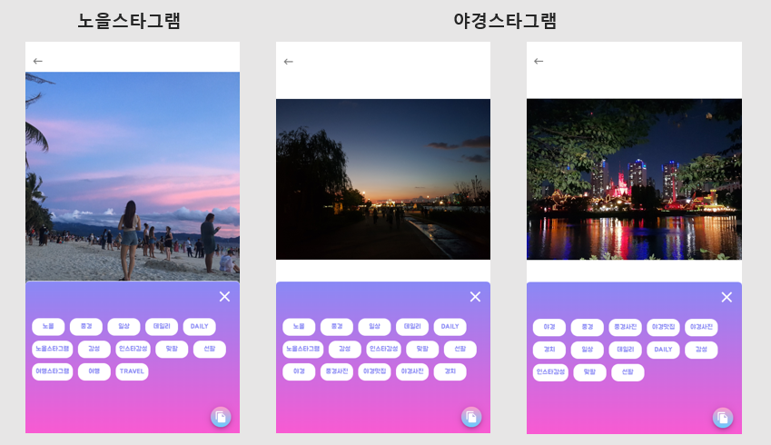

  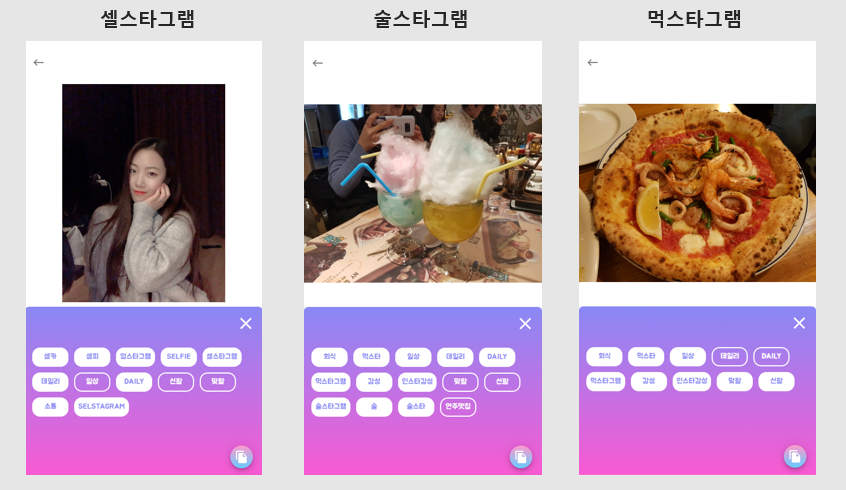

  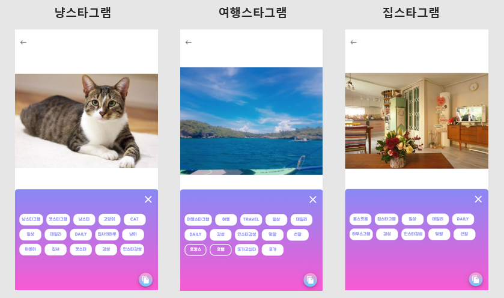


<br/>


<br/>

<b style="color: #8989f5">객체선택  - 원하는 특정 영역만 필터 및 효과 적용</b>


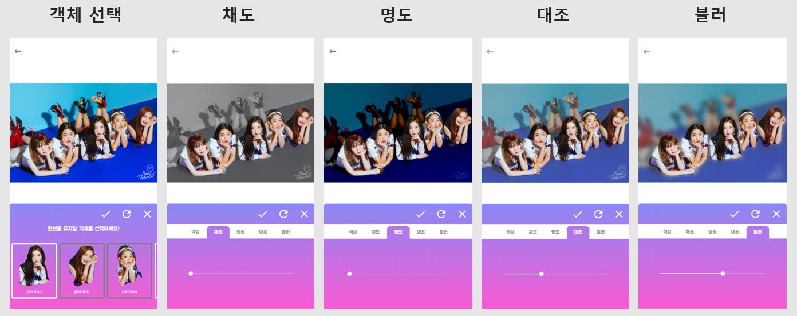

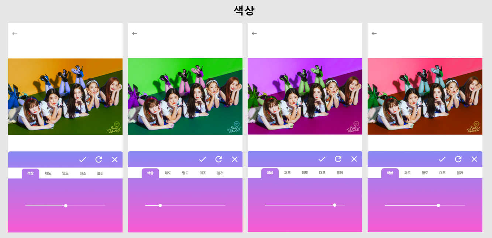

<br/>

<br/>

<b style="color: #8989f5">블러처리</b>

- <b>블러처리</b>

  - 타인의 초상권을 위해 사진에 나온 제 3자를 자동 블러처리

  - 원하지 않는 얼굴은 직접 선택하여 블러 제거 가능

    
    <div align="center">
        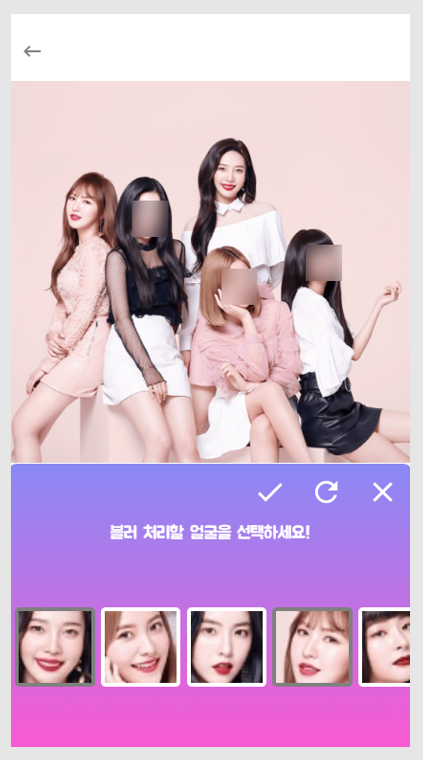</img>
    </div>
  

  

<br/><br/><br/>

#### <b style="color: #b277e8">기본기능</b>

+ <b>사진 자르기</b>

  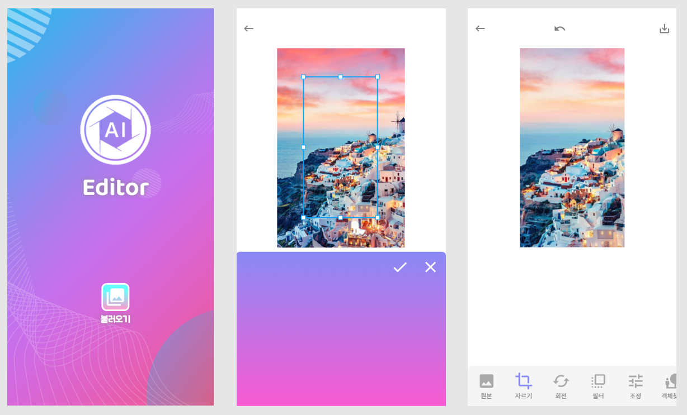

  <br/><br/>

+ <b>사진 회전</b>

  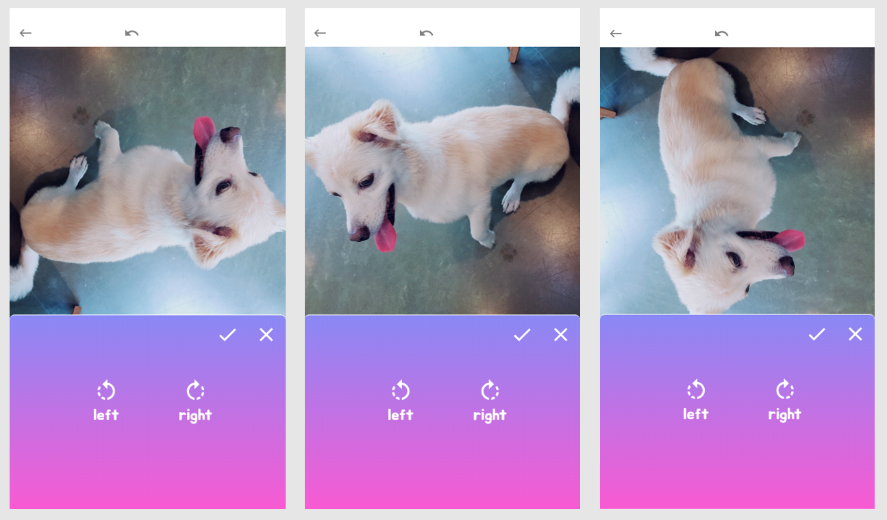

  <br/><br/>

+ <b>사진 필터</b>
  
  + 수동 필터 및 자동 필터 기능
  
  + 무려 <b>30</b>개의 <b style="color:#C00000">HOT</b>한 필터 제공!!
  
    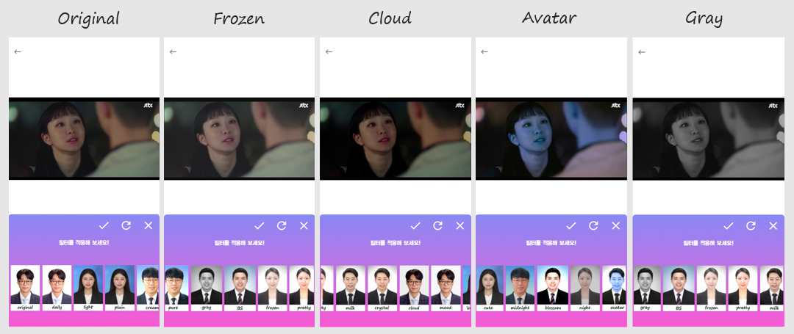
  
  <br/><br/>
  
+ <b>되돌리기</b>

  - 편집 이전, 이후로 상태를 전환하는 기능

  <br/><br/>

+ <b>내부 저장소로 내보내기</b>

  - 편집한 사진을 디바이스에 저장하는 기능

  <br/><br/>

<br/>

<br/>

### :heart: Instagram - aiditor_official


<br/>


<div align="center">
    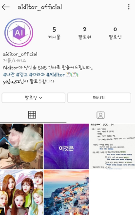</img>
</div>

<br/>

<br/>


### :star: <b>Develop Rules</b>

  <b>branch</b>

```
 master -> develop -> front -> feature/hashtag
```

  **merge**

```
merge 하기 전에 서로 코드 리뷰하기

merge 후 브랜치 지우기
```

  <b>commit</b>

```
S02P22A301-4 | DONE | 스켈레톤 코드 다운로드 및 clone
```

  <b>Readme.md</b>

```
데일리 업무 내용 정리
```

<br/>

<br/>

### :bulb: Stack</b>

#### <b style="color: #b277e8">Frontend</b>

- React.js, Konva


#### <b style="color: #b277e8">Backend</b>

- Python, Flask, CNN, Mask-RCNN, Face Recognition

<br/>

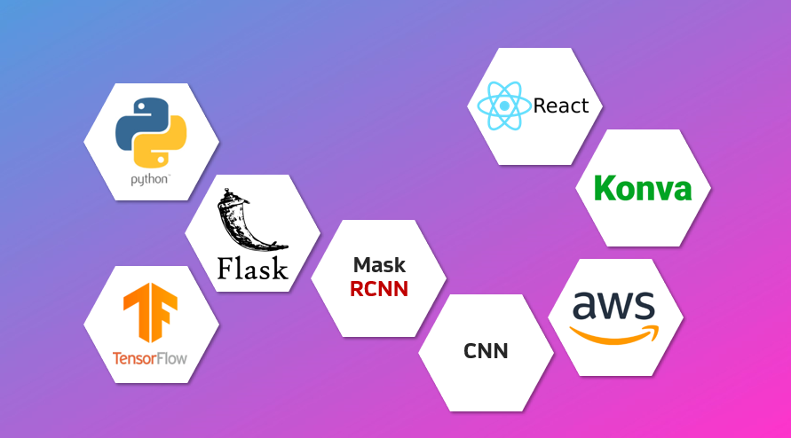

<br/>

<br/>

<br/>

### <b>:calendar: Develop process</b>

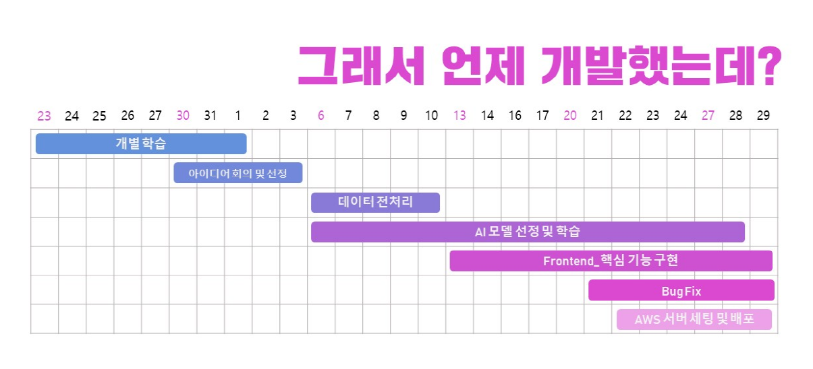

